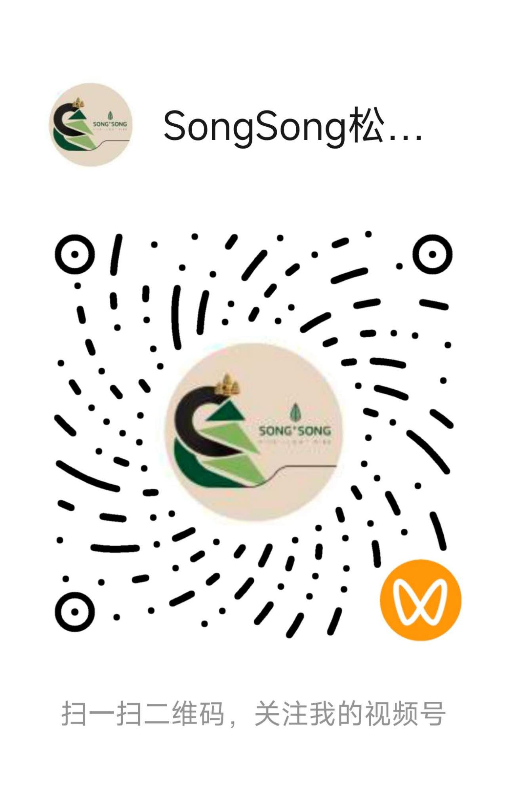

## 📜 《道德经》原文对照
### 【主歌一】(通用版) 
吾言甚易知，甚易行。 
天下莫能知，莫能行。 
言有宗，事有君。 
夫唯无知，是以不我知。 
知我者希，则我者贵。 
是以圣人被褐(hè)而怀玉。 

### 【主歌二】（帛书版）
吾言甚易知也，易行也； 
而天下人莫之能知也，莫之能行也。 
夫言又宗，事又君。 
夫唯無知也，是以不我知。 
知者希，則我貴矣。 
是以聖人被褐(hè)而褱(huái)玉。 

### 🎬 歌曲视频

  点击下方视频 ▶️

<iframe
  src="https://streamable.com/e/jy7lv5"
  width="640"
  height="360"
  frameborder="0"
  allowfullscreen
  loading="lazy">
</iframe>
---

## 【引】
老子说：“吾言甚易知，甚易行”，可为何天下人“莫能知，莫能行”？ 
这不是悖论，而是现实——道本简易，而人心好繁；道性自然，而人性多欲。 
老子之言，非权谋权术，非哲学体系，而是道体自然流出的生命之语， 
所谓“言有宗，事有君”：“宗”者，道之本源；“君”者，心之主宰。 
言从道出，事归本心，故其言易知，其行易行——但也因此，反为世人所忽。 
人多向外求法，向远逐名，却不识本心之简、不信日用之道，故曰“无知”。 
而“知者希”，恰显“我贵”——非贵老子之名，而是贵那一条返本复常之道。 

## 【悟】
佛陀曰：“一花一世界，一石一如来”，可有几人真信？ 
老子曰：“吾言甚易知，甚易行，天下莫能知，莫能行”，其意亦然：道从不曾远离我们，就在呼吸之间。 
只是我们太执着于外相，太习惯在他人那里寻找答案。 
常常错把“被褐”当贫贱，忘了“怀玉”正是自己本具的性命之明。 
真正的“知”，不是懂了多少道理，而是能看见这“无为中有为，简中藏深”的大道之光； 
真正的“行”，不是修了多少功法，而是能在日常起心动念中，返观内照，复归于常。 
愿我们不再妄求彼岸，不复远求。 

## 【诗】
《褐中藏玉》·青隐子 

言简而深无人信， 道近反觉似幽深。 
褐衣不语怀中宝， 静照常明是我心。 
妄逐远方空劳役， 原来道在自家身。 

## 【字词解义】

◎ 宗：本源、根本。言有宗，指老子之言皆出自“道”的本源，而非人心造作之说。 

◎ 君：主宰、核心。事有君，表示行事不离本心、不离道心。 

◎ 无知：非愚蠢，而是“不知常道”、“不识本性”的迷失状态，是人远离本心的“无明。 

◎ 被褐而怀玉：表面简朴无华，内藏真道之德。象征圣人不炫其能、不露其光，亦象征“道不在远、宝藏自存”。  
&nbsp;&nbsp;&nbsp;&nbsp;褐hè：本义：粗布衣、粗麻布衣服，常用于形容贫寒之人、地位低下者所穿之衣。 

◎ 褱huái：“褱”是“怀”的异体字、古字，含义基本相同，但更突出“藏于衣中”的含义。 

---
##  互参之门 | 视频号互动❤️🤝

若此章有所触动、疑问或想深入交流，欢迎扫码关注我的视频号【SongSong松的歌】，可留言互参、彼此印证。 

⛰️ 注：本章标题为松Song所拟，原文无章名，仅作导览参考。 

本站内容为作者原创心注，欢迎阅读分享；若需引用，请先取得授权或注明出处🙏

  🔙 <a href="{{ '/' | relative_url }}#catalog">返回目录</a>

